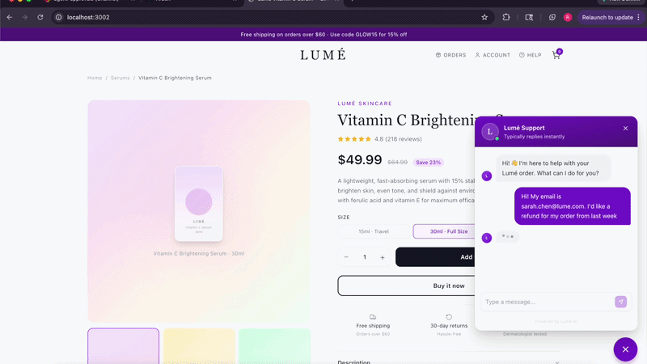

# ardenpy

**Policy enforcement and human approval for AI agent tool calls.**

[](https://github.com/ardenhq/adenpy/actions/workflows/test.yml)
[](https://pypi.org/project/ardenpy/)
[](https://pypi.org/project/ardenpy/)
[](https://codecov.io/gh/ardenhq/adenpy)
[](https://opensource.org/licenses/MIT)



Arden sits between your agent and its tools. Every call is checked against policies you configure in the dashboard — automatically allowed, blocked, or held for a human to approve.

## Install

```bash
pip install ardenpy
```

## Claude Code skill

Let Claude Code integrate Arden into your project automatically — it detects your framework, adds the dependency, inserts `configure()`, and optionally sets up session tracking:

```bash
# Add the skill to your project
mkdir -p .claude/commands
curl -o .claude/commands/arden-setup.md \
  https://raw.githubusercontent.com/ardenhq/adenpy/main/skills/arden-setup.md
```

Then in Claude Code, run:
```
/arden-setup
```

## Quick start

**1. Get your API key** from [app.arden.sh](https://app.arden.sh). You'll get two keys:
- `arden_test_...` — development, hits `api-test.arden.sh`
- `arden_live_...` — production, hits `api.arden.sh`

**2. Configure once**

```python
import ardenpy as arden
arden.configure(api_key="arden_live_...")
```

**3. Call your tools**

For **LangChain, CrewAI, and OpenAI Agents SDK** — that's it. Arden auto-patches all three frameworks at configure-time, so every tool call is intercepted without any wrapping:

```python
# LangChain, CrewAI, or OpenAI Agents SDK — use tools normally
arden.configure(api_key="arden_live_...")

agent = create_react_agent(llm, tools, prompt)  # no wrapping needed
# Every tool call is now enforced and logged automatically
```

For **custom agents with no framework**, wrap functions explicitly:

```python
def issue_refund(amount: float, customer_id: str) -> dict:
    return {"refund_id": "re_123", "amount": amount}

safe_refund = arden.guard_tool("stripe.issue_refund", issue_refund)

result = safe_refund(150.0, customer_id="cus_abc")
# Arden checks policy first — allow, block, or wait for human approval
```

---

## How it works

Every tool call goes through a policy check before executing:

| Policy decision | What happens |
|----------------|-------------|
| `allow` | Function executes immediately |
| `block` | `PolicyDeniedError` raised, function never runs |
| `requires_approval` | Pauses until a human approves or denies on the dashboard |

**No policy configured?** The call is allowed automatically and logged — you get a full audit trail from day one and can add policies incrementally.

---

## Approval modes

When a tool requires approval, you choose how your code waits:

**`wait` (default)** — blocks until a human acts, then executes or raises `PolicyDeniedError`.

**`async`** — returns a `PendingApproval` immediately, background thread polls and calls your callback.

**`webhook`** — returns `PendingApproval` immediately, no polling. Arden POSTs to your endpoint when an admin decides.

```python
# wait (default)
safe_refund = arden.guard_tool("stripe.issue_refund", issue_refund)

# async
safe_refund = arden.guard_tool("stripe.issue_refund", issue_refund,
    approval_mode="async", on_approval=handle_approval, on_denial=handle_denial)

# webhook
safe_refund = arden.guard_tool("stripe.issue_refund", issue_refund,
    approval_mode="webhook", on_approval=on_approval, on_denial=on_denial)
```

For webhook setup (FastAPI, Flask, Django examples) see the [Library Reference](LIBRARY_REFERENCE.md#webhook-integration).

---

## Framework integrations

### LangChain, CrewAI, and OpenAI Agents SDK — zero wrapping required

Arden automatically patches all three frameworks when `configure()` is called. Every tool call in the process is intercepted — including tools created after configure is called.

```python
import ardenpy as arden

arden.configure(api_key="arden_live_...")
# All tool calls are now intercepted, enforced, and logged.
# No protect_tools(), no guard_tool(), no boilerplate.
```

| Framework | What gets patched |
|-----------|------------------|
| LangChain | `BaseTool.run` at the class level |
| CrewAI | `BaseTool.run` at the class level |
| OpenAI Agents SDK | `FunctionTool.__init__` — wraps `on_invoke_tool` per instance |

Tool names in the dashboard match each tool's `.name` attribute. If you don't already have the framework installed, install it alongside ardenpy:

```bash
pip install ardenpy langchain-core                   # LangChain
pip install ardenpy crewai                           # CrewAI
pip install ardenpy openai-agents                    # OpenAI Agents SDK
```

### OpenAI Chat Completions (raw loop)

The Chat Completions API has no patchable base class. Use `ArdenToolExecutor` to register and dispatch tool calls:

```python
from ardenpy.integrations.openai import ArdenToolExecutor

executor = ArdenToolExecutor()
executor.register("issue_refund", issue_refund_fn)
executor.register("send_email",   send_email_fn)

# In your tool-call loop:
result = executor.run(tc.function.name, json.loads(tc.function.arguments))
```

See [examples/](examples/README.md) for runnable code for every integration.

---

## Session tracking

Attach a session ID to group all tool calls from a single conversation in the action log:

```python
import ardenpy as arden
import uuid

arden.configure(api_key="arden_live_...")

# Set once per request — all guard_tool and auto-patched calls carry it automatically
arden.set_session(str(uuid.uuid4()))
```

Uses `contextvars.ContextVar` — safe for concurrent async requests. Fully optional.

---

## Token usage tracking

Arden automatically tracks token usage and estimated cost for every LLM call — no extra setup needed. For LangChain, CrewAI, and the OpenAI Agents SDK, `configure()` captures usage from the framework at runtime and sends it to the dashboard in a background thread (zero latency impact).

```python
import ardenpy as arden

arden.configure(api_key="arden_live_...")
# Token usage is now tracked automatically alongside tool calls.
# View cost breakdowns by model, day, and session in the dashboard.
```

For custom agent loops where you call the LLM directly, log usage manually:

```python
response = openai_client.chat.completions.create(
    model="gpt-4o",
    messages=messages,
)
arden.log_token_usage(
    model="gpt-4o",
    prompt_tokens=response.usage.prompt_tokens,
    completion_tokens=response.usage.completion_tokens,
)
```

| What gets tracked | Automatically? |
|---|---|
| LangChain (`BaseChatModel`) | Yes — auto-patched by `configure()` |
| CrewAI | Yes — uses LangChain under the hood |
| OpenAI Agents SDK (`Runner.run`) | Yes — auto-patched by `configure()` |
| OpenAI Chat Completions (raw loop) | Manual — call `arden.log_token_usage()` |
| Any other LLM | Manual — call `arden.log_token_usage()` |

The dashboard shows cost broken down by model, day, and session — all scoped per agent.

---

## Error handling

```python
try:
    result = safe_refund(150.0, customer_id="cus_abc")
except arden.PolicyDeniedError:
    # blocked by policy, or denied by a human
except arden.ApprovalTimeoutError:
    # nobody approved within max_poll_time (wait mode)
except arden.ArdenError:
    # API/configuration error
```

---

## Links

- [Library Reference](LIBRARY_REFERENCE.md) — full API docs
- [Examples](examples/README.md) — runnable code
- [Dashboard](https://app.arden.sh)
- [PyPI](https://pypi.org/project/ardenpy/)
- [Support](mailto:team@arden.sh)
